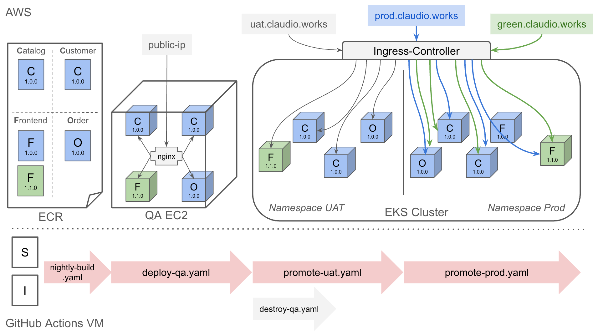

# Automatic Promotion & Blue/Green Deployment

This project 
- Demonstrates Automatic promotions to QA, UAT and Production.
- Conducts blue/green deployment in the Prod environment.

### Tools:

- **Docker**: Containerizes a microservice.
- **GitHub Actions**: Automates the workflows.
- **AWS EC2**: Deploy the app in a QA environment.
- **AWS EKS Cluster**: Deploy the app in a UAT and Prod environments.
- **Amazon ECR**: Saves Docker images.
- **AWS Route53**: Hosts a domain name `claudio.works`.
- **Terraform**: Launches an EC2 instance
- **Packer**: Creates an AMI image that is installed Docker and docker-compose.
- **Kubernetes**: Controls the EKS cluster.

### Environments:

- Source repo: https://github.com/knakatasf/microservice-source
  
  It contains 4 microservices: Catalog, Customer, Order and Frontend
- QA: AWS EC2 instance with nginx
- UAT: AWS EKS Cluster with namespace uat, Nginx-Ingress Controller
- Production: AWS EKS Cluster with namespace prod, Nginx-Ingress Controller

### Workflows:

**1. nightly-build.yaml**

- Detects which microservice in the source repo is changed.
- Only builds the changed microservice's Docker image and pushes it to ECR.
- Image tag looks like: frontend:v1.1.0-qa-(date), which means this image is ready for QA tests.

**2. deploy-qa.yaml**

- When a new image is successfully pushed to ECR, this is automatically invoked.
- Environments variables of which microservice was updated and the image tag is passed from the previous workflow to this workflow.

- Launches an EC2 instance using Terraform.
- Transfers the `docker-compose.qa.yaml` filled with environment variables by `envsubst` and `nginx.conf` file. `docker-compose.qa.yaml` contains an nginx image to deploy a reverse proxy in the EC2 instance.
- Docker compose up!

**3. promote-uat.yaml**

- When QA tests pass, invoke this workflow.
- Input which microservice to promote to the UAT environment, and its qa tag to start the workflow.
- First, it re-tags the qa image to a rc tag something like: frontend:v1.1.0-rc-(date), which means it's ready for UAT tests.
- Now, an EKS cluster is pre-defined with cluster name being `eks-microservice`.
- Install an Nginx-Ingress Controller in the cluster.
- Apply `Deployment` yaml files for each microservice; Only promoted microservice uses the rc image, otherwise uses the images with `latest` tag.
- Use the `version` field to keep track with which Deployment is attached to which service (ClusterIP).
- Apply `Ingress` rule yaml file to route the traffic to appropriate services (ClusterIPs). It holds hostname to host the app in the domain name.
- Upsert a new CNAME record to the hosted zone to map the domain name: `uat.claudio.works`.

**4. promote-prod.yaml**

- When UAT tests pass, invoke this workflow.
- Input which microservice to promote to the Prod environment, and its rc tag to start the workflow.
- First, it re-tags the rc image to a ga tag something like: frontend:v1.1.0-ga, which means it's ready for Production.
- Only apply `Deployment` yaml files for the promoted microservice; Only promoted microservice uses the rc image.
- Apply `Ingress` rule yaml file to create a new traffic (green), which points to the promoted microservice.
- Upsert a new CNAME record to the hosted zone to map the domain name: `green.claudio.works`.
- The last workflow waits for your review; this mechanism is achieved by `environment` feature of GitHub Actions.
- Once you're happy with the green version, re-apply the blue `ingress` yaml file so that it points to green microservice.

